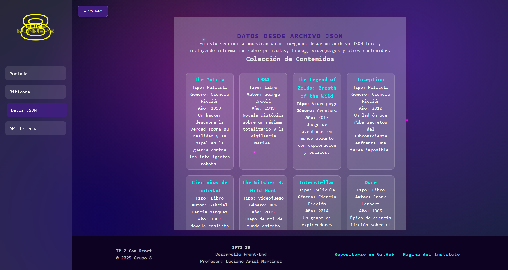
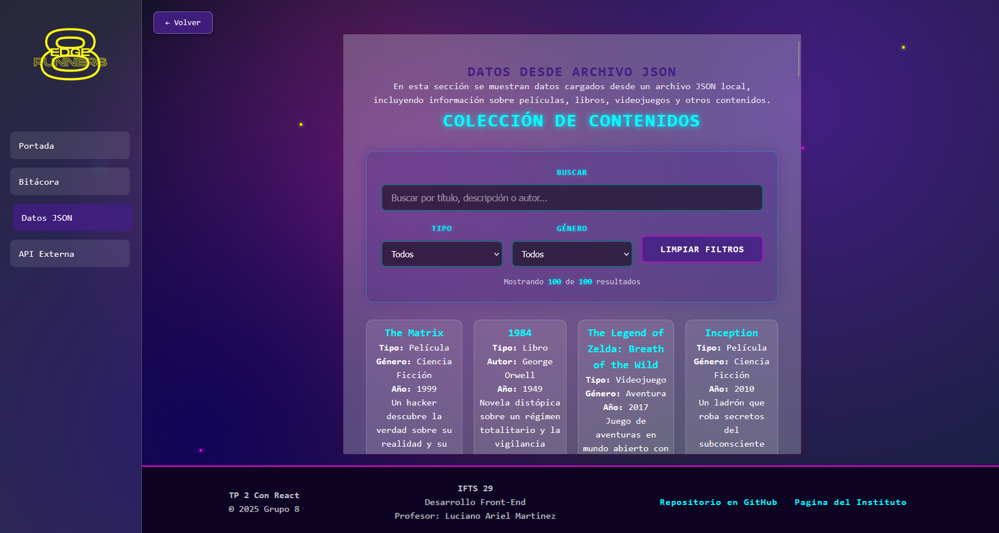
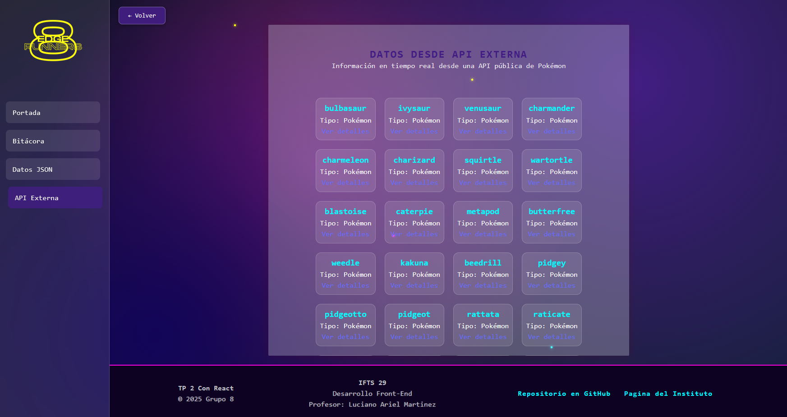
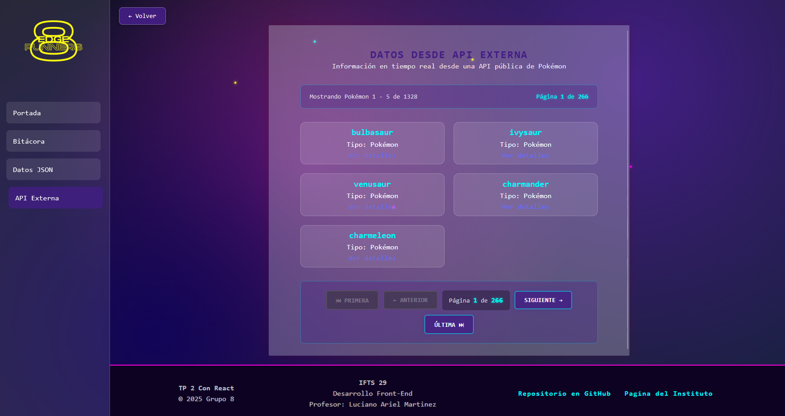
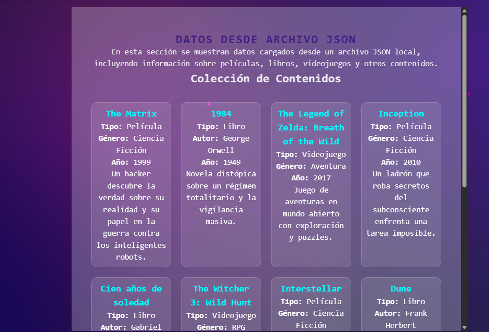
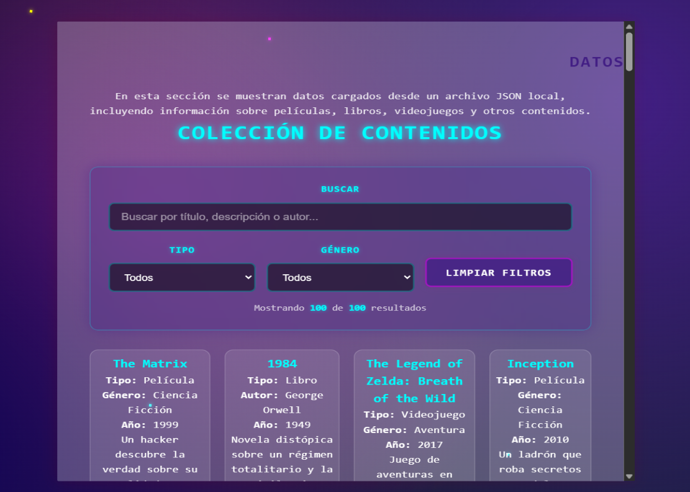
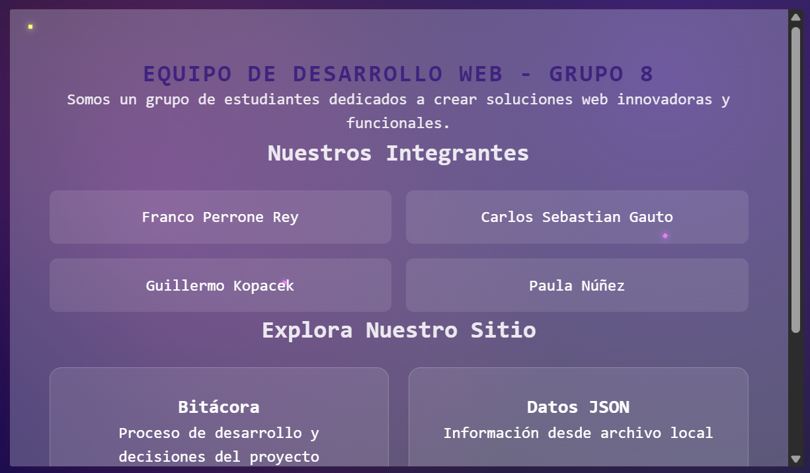
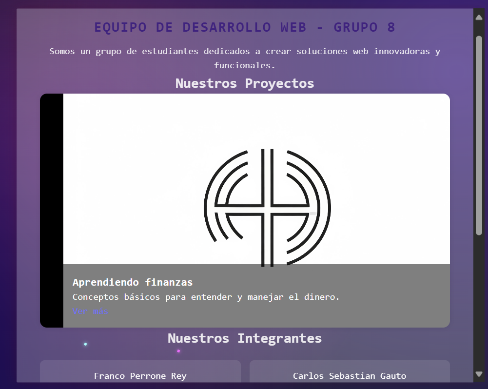

# Front_grupo8_tpo3
En el siguiente README se detallan las nuevas mejoras implementadas en el proyecto. Se incluye una imagen representativa del estado anterior y otra que muestra la mejora aplicada, acompañada de una breve descripción que explica los cambios realizados y su impacto funcional o visual.

---

### Actualización: Barra de Progreso para Skills
Antes:
El perfil mostraba las habilidades listadas únicamente en formato de texto, sin una referencia visual del nivel de dominio.

 
Ahora:
Con esta actualización, cada habilidad se presenta como una barra de progreso. Esto permite visualizar no solo el nombre de la skill, sino también el nivel de competencia asociado, representado gráficamente.

Esta mejora aporta una experiencia más intuitiva y atractiva para quienes consultan el perfil, facilitando la evaluación rápida de las capacidades del usuario

---

### Búsqueda/Filtrado en JSON Local:
Antes:
No había filtros, se mostraba la lista completa de datos de películas, libros y videojuegos.

Ahora:
Se implementó un sistema completo de búsqueda y filtrado para los datos del archivo JSON local, permitiendo a los usuarios encontrar contenido de forma más eficiente. (Búsqueda por texto, Filtros por categorías, Botón "Limpiar Filtros", Contador de resultados.)

Con éstos filtros el usuario puede buscar por tipo, por género, ver la cantidad de resultados de cada uno, o escribir en la bara de búsqueda por un dato específico.

---

### Paginación para la API Externa: 
Antes:
Se mostraban todos los resultados de la api en la misma página, para no sobrecargarla se establecía un límite en la url traída por axios a 20.

Ahora: Se implementó paginación para los datos de la api. El límite de elementos mostrados se configura en la constante ITEMS_POR_PAGINA. Se puede avanzar a la página siguiente o anterior y también ir directamente al final o al inicio. Además se muestra la página actual y el total de páginas.

---

### Mejoras visuales en módulos:
Antes:
Los modulos de API, BITACORA y DATAJSON no contaban con implementacion visual dinamica

Ahora:
Se agregaron animaciones suaves en los módulos de Bitácora, Datos y API, que anteriormente no contaban con implementación visual dinámica. Esto mejora la experiencia del usuario al aportar transiciones más fluidas y coherentes

---

### Mejoras visuales en carrusel:

Antes:  
La interfaz no contaba con un carrusel para mostrar contenido visual. Las imágenes se presentaban de forma estática, sin interacción ni transición.

Ahora:  
Se implementó un carrusel dinámico que permite visualizar imágenes con transiciones suaves y navegación automática. Esto mejora la experiencia del usuario al aportar movimiento, organización y estética visual.

