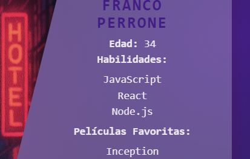
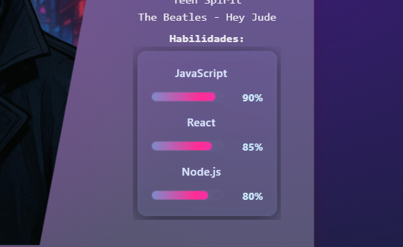

# Front_grupo8_tpo3
En el siguiente README se detallan las nuevas mejoras implementadas en el proyecto. Se incluye una imagen representativa del estado anterior y otra que muestra la mejora aplicada, acompañada de una breve descripción que explica los cambios realizados y su impacto funcional o visual.

---

### Actualización: Barra de Progreso para Skills
Antes:
El perfil mostraba las habilidades listadas únicamente en formato de texto, sin una referencia visual del nivel de dominio.

 
Ahora:
Con esta actualización, cada habilidad se presenta como una barra de progreso. Esto permite visualizar no solo el nombre de la skill, sino también el nivel de competencia asociado, representado gráficamente.

Esta mejora aporta una experiencia más intuitiva y atractiva para quienes consultan el perfil, facilitando la evaluación rápida de las capacidades del usuario

---

